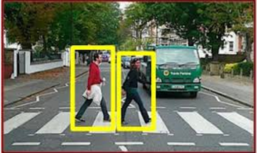
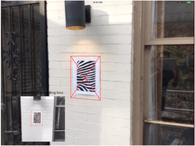
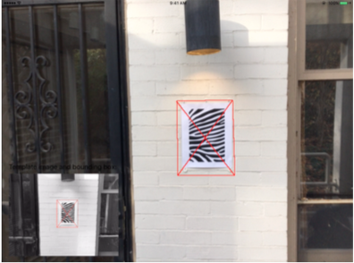
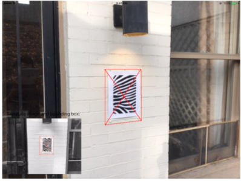

# CMU 15-418 Final Project
Final Project for 15-418 (Parallel Computer Architecture and Computing) at Carnegie Mellon University.

## Team Members ##
- Siddhant Wadhwa (swadhwa@andrew.cmu.edu)
- Druhin Sagar Goel (dsgoel@andrew.cmu.edu)

## Summary ##
A parallel C++ Computer vision library that uses SIMD vector instructions and takes advantage of the multiple cores and GPUs.
Think *A C++ Matlab for Computer Vision*!

## Background ##
Computer Vision algorithms most often involve repeated computation over all pixels in an image, which led us to believe that
the scope for speedup using parallel algorithm design techniques is enormous.

### Low-level functions ###
At the most basic level, a large number of computer vision alogrithms make excessive use of **convolution using image filters**. Image filtering requires
neghbourhood operations around every pixel, making it a prime target for parallelization, as shown in the following illustration:

How computers understand images is very different from how they are perceived by the human mind. In order to effeiciecntly store 
the required information about pixels, a large fraction of computer vision algorithms prefer to use feature descriptors over 
pixel intensities, which often take much lesser space to store than raw intensities and are faster to match and make use of.
Consider the following illustration in which, instead of storing raw image intenisities, like in (a), we decide to store only the
results of the pixel's intensity-based comprisons with its neighbours. Each pixel now only needs a few bits to store the requires
information:

We plan to include support for the popular feature descriptors in use today. Like image convolution with filters, **feature descriptor
computation and matching** can benefit greatly with parallelization due to independent and repeated computations over pixels.

The 2 of the above functions are only a small set of examples of the functions we plan to optimize, using parallel algorithm design techniques.

### High-level Computer Vision pipelines ###
*Need to add descriptions and illustrations here*
- **Feature extraction** : Often involves very parallelizable processes such as gradient calculation accross all pixels of the image.

- **Image classification** : Apply parallelization in the space of machine learning to classify images. One approach to spped up learning using parallel computation would be to build the *dictionary* of visual words in parallel on the GPU.

- **Object detection** : We could paralellize the process of object detection by the windowed application of the iamge classification pipeline accross multiple cores.                                               

- **Image alignment** : We aim to write a highly parallelized version of the inverse-compositional Lukas-Kanade algorithm, by optimizing the comparisons using SIMD instructions.                                

- **Image stitching** : Using the parallel versions of low-level functions, image stitching (used extensively in SLAM, or even on your phones to create panoramas!) can be made to run much faster.

- If we're still left with time : **3D reconstruction from motion** or **Stereo matching** :

## The Challenge ##

WUT CHALLENGE? 
The most challenging aspect of this project should be optimizing otherwise-standard algorithms for SIMD and multicore execution while preserving insruction stream coherence and cache locality. In addition, setting flexible parameters for parallel work distribution, that best suit the user's hardware, could also require a lot a testing.

## Resources ##
- CMU's 16-385 : Undergrad level Computer Vision course
- http://www.engr.colostate.edu/~hj/conferences/47.pdf
- http://algo.yonsei.ac.kr/international_JNL/APCVsystem98Kim.pdf
- http://grid.cs.gsu.edu/~tcpp/curriculum/sites/default/files/Teaching%20Parallel%20Programming%20Using%20Computer%20Vision%20and%20Image%20Processing%20Algorithms(paper).pdf

## Goals and Deliverables ##
### Plan to Achieve ###
- In our demo, our primary aim is to display live the speedups we achieved by appyling the principles of parallel algorithm design that we learnt in this course.
- We aim to do this by juxtaposing live demos of the sequential and parallel versions of the Computer Vision pipelines we're building and plotting speedup graphs for a direct quantitative comparison.

### Hope to Achieve ###
- In the case that we're not running behind on schedule, we've allocated April 23rd to April 30th to extend some of the CV pipelines to work with 3D point clouds from the Kinect 2.0 sensor.
- Basically, extending our pipelines from 2D to 3D

## Platform Choice ##
We have chosen to write our library in C++:
- for the low-level system control it offers
- to utilize compatible GPU and multi-core libraries and modules such as OpenMP, CUDA, SSE and AVX instructions
- due to its high speed and lower overheads

For our depth camera (required for the *Hope to achieve* goals), we chose the Kinect 2.0 from Microsoft due to its quality of  documentation and large open-source community support, in addition to the quality of senosr output.

## Schedule ##

| Week ending | Target                                                                                       |
|-------------|----------------------------------------------------------------------------------------------|
| April 9th   | Finish writing low-level functions with parallel-computing optimizations                     |
| April 16th  | Finish writing sequential version of high-level CV pipelines                                 |
| April 23rd  | Optimize and add-in parallel-computing support for high-level pipelines                      |
| April 30th  | If running on schedule, then extend support for 3D point clouds                              |
| May 7th     | Compile speedup and project reports and refactor code, and prepare for the the presentation! |
