# CMU 15-418 Final Project
Final Project for 15-418 (Parallel Computer Architecture and Computing) at Carnegie Mellon University.

(Updated on April 19, 2016)

## Team Members ##
- Siddhant Wadhwa (swadhwa@andrew.cmu.edu)
- Druhin Sagar Goel (dsgoel@andrew.cmu.edu)

## Summary ##
We're implementing a GPU based Computer Vision API that implements common CV primitives that benefit greatly in terms of performance on the GPU. In addtion, we shall be using these primitives to write commonly used Computer Vision pipelines that can be optimized for the GPU.

## Background ##
Computer Vision algorithms most often involve repeated computation over all pixels in an image, which led us to believe that
the scope for speedup using parallel algorithm design techniques is enormous.

### Computer Vision Primitives ###
At the most basic level, a large number of computer vision alogrithms make excessive use of **convolution using image filters**. Image filtering requires
neghbourhood operations around every pixel, making it a prime target for parallelization, as shown in the following illustration:

How computers understand images is very different from how they are perceived by the human mind. In order to efficiently store 
the required information about pixels, a large fraction of computer vision algorithms prefer to use feature descriptors over 
pixel intensities, which often take much lesser space to store than raw intensities and are faster to match and make use of.
Consider the following illustration in which, instead of storing raw image intenisities, like in (a), we decide to store only the
results of the pixel's intensity-based comparisons with its neighbours. Each pixel now only needs a few bits to store the requires
information:

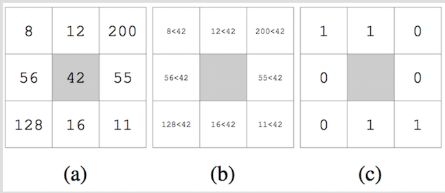

We plan to include support for the popular feature descriptors in use today. Like image convolution with filters, **feature descriptor
computation and matching** can benefit greatly with parallelization due to independent and repeated computations over pixels.

The 2 of the above functions are only a small set of examples of the functions we plan to optimize, using parallel algorithm design techniques.

### High-level Computer Vision pipelines ###

- **Feature extraction** : Often involves very parallelizable processes such as gradient calculation accross all pixels of the image.
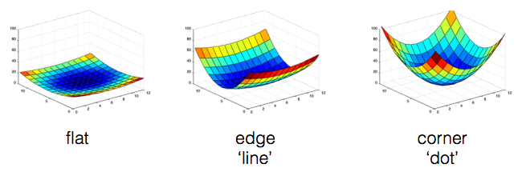
- **Image classification** : Apply parallelization in the space of machine learning to classify images. One approach to speed up learning using parallel computation would be to build the *dictionary* of visual words in parallel on the GPU. In addition, if left with time, we plan to implement a GPU-specific mean clustering algorithm that does gradient descent over all points to be clustered in parallel. More details in this paper (http://koen.me/research/pub/vandesande-itm2011-VisualCategorizationGPU.pdf).
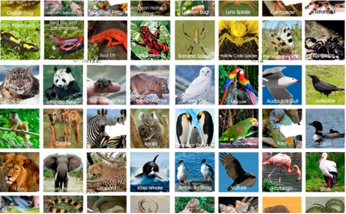
- **Image stitching** : Using the parallel versions of low-level functions, image stitching (used extensively in SLAM, or even on your phones to create panoramas!) can be made to run much faster.
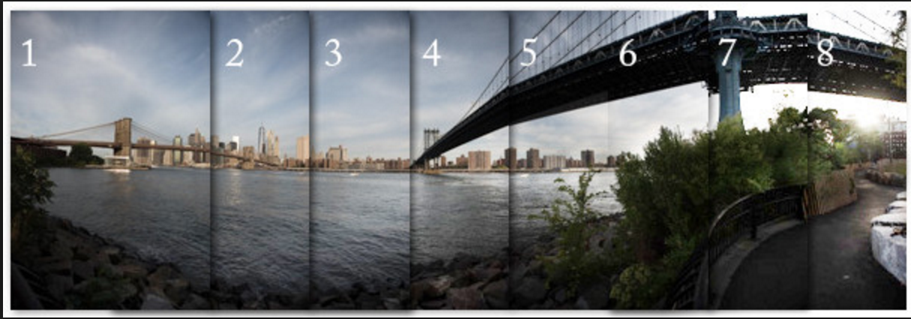
- **HIGHLIGHT : Real time Stereo matching on the GPU using CUDA** : Implementation of real-time dense stereo matching that leverages local methods (that exploit SIMD and spatial locality inherent in image data), parallelized-dynamic programming over all epipolar lines and post-processing.
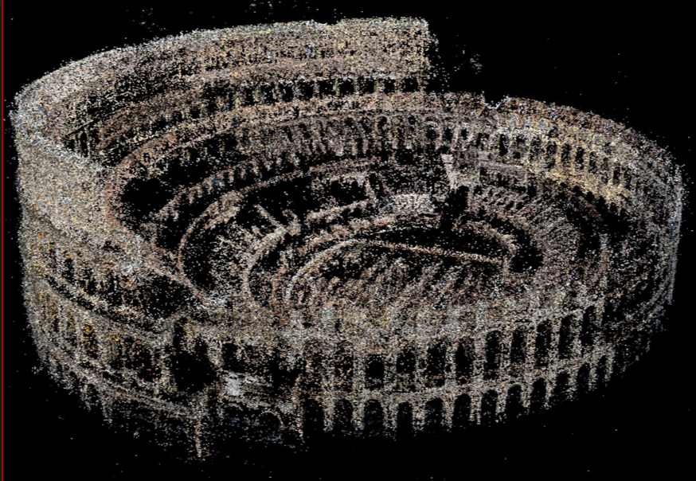
- If left with time, we plan to try to **improve the resolution and quality of kinect depth maps** by fusing results from our stereo matching pipeline with ASIC-implemented depth estimation on the Kinect. More details on (http://file.scirp.org/pdf/OJAppS_2013012215594588.pdf)

## The Challenge ##

The most challenging aspect of this project should be implementing and optimizing **Real Time Stereo matching on the GPU** and if left with time, **Bag-of-words based image classification on the GPU with fully parallel mean shift clustering algorithm**. They will require explicit use of global and shared GPU memory and synchronization across highly parallel pieces of code. Other challenges include optimizing otherwise-standard CV algorithms for SIMD and multicore execution while preserving insruction stream coherence and cache locality. In addition, setting flexible parameters for parallel work distribution, that best suit the user's hardware, could also require a lot of testing.

## Resources ##
- CMU's 16-385 : Undergrad level Computer Vision course
- http://www.engr.colostate.edu/~hj/conferences/47.pdf
- http://algo.yonsei.ac.kr/international_JNL/APCVsystem98Kim.pdf
- http://grid.cs.gsu.edu/~tcpp/curriculum/sites/default/files/Teaching%20Parallel%20Programming%20Using%20Computer%20Vision%20and%20Image%20Processing%20Algorithms(paper).pdf
- http://cadcamcae.eafit.edu.co/documents/09_09_2009_Congote_etal_TV_stereo_depthmap_CUDA.pdf
- http://file.scirp.org/pdf/OJAppS_2013012215594588.pdf

## Goals and Deliverables ##
### Plan to Achieve ###
- In our demo, our primary aim is to display live the speedups we achieved by appyling the principles of parallel algorithm design that we learnt in this course.
- We aim to do this by juxtaposing live demos of the sequential and parallel versions of the Computer Vision pipelines we're building and plotting speedup graphs for a direct quantitative comparison. This will include a live real time demo of depth estimation using stereo matching with the Kinect.

### Hope to Achieve ###
- If we're left with time on our hands, then we hope to be able to implement the **mean shift clustering** algorithm for the GPU, for use in our image classification pipeline.

## Platform Choice ##
We have chosen to write our library in C++:
- for the low-level system control it offers
- to utilize compatible GPU and multi-core libraries and modules such as OpenMP, CUDA, SSE and AVX instructions
- due to its high speed and lower overheads

For prototyping, we are using MATLAB:
- for fast paced prototype development and testing against the matlab-native implementations of Computer Vision algorithms.

For our depth camera (required for the *Hope to achieve* goals), we chose the Kinect from Microsoft due to its quality of  documentation and large open-source community support, in addition to the quality of sensor output. Plus, we can compare our resulting depth maps from stereo matching to the ASIC implementation onboard the Kinect for baseline quality comparisons.

## Schedule (Updated accroding to progress till checkpoint)##

| Week ending | Target                                                                                                                              | Assigned to             |
|-------------|-------------------------------------------------------------------------------------------------------------------------------------|-------------------------|
| April 19th  | Finished writing MATLAB pipeline prototypes to check for correctness                                                                | Both (done)             |
| April 21st  | Finish writing primitives with parallel-computing optimizations in C++                                                              | Druhin                  |
|             | Translate stereo matching to C++ and test on Kinect                                                                                 | Sid                     |
| April 24th  | Prepare for Exam 2                                                                                                                  | Both                    |
| April 28th  | Translate other MATLAB pipelines to C++                                                                                             | Both (pair programming) |
| May 1st     | Optimize and parallelize C++ pipelines                                                                                              | Both (pair programming) |
| May 5th     | If running on schedule, implement mean shift clustering                                                                             | Druhin                  |
|             | If running on schedule, implement fusion of  stereo-pair depth maps with Kinect ASIC-results to obtain higher resolution depth maps | Sid                     |
| May 8th     | Compile speedup and project reports and refactor code, and prepare for the the presentation!                                        | Both                    |

## Preliminary Results ##
(MATLAB prototypes are offline due to overlap with Computer Vision class work)

- **Image Classification Pipeline:** Our prototype achieves around 60% accuracy for labeling images out of 8 categories with our test-training set. 
- **Stereo Matching Pipeline:**
    - Finding Epipolar lines in stereo pair                                 
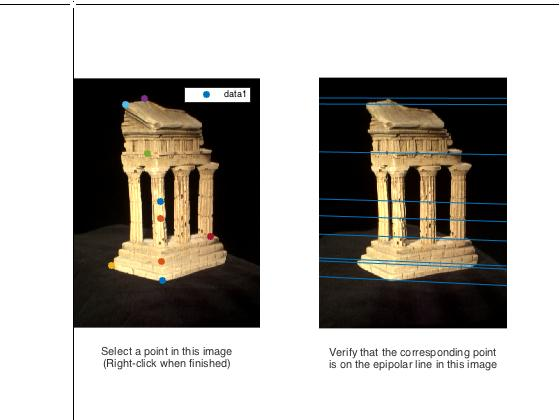
    - Rectifying images
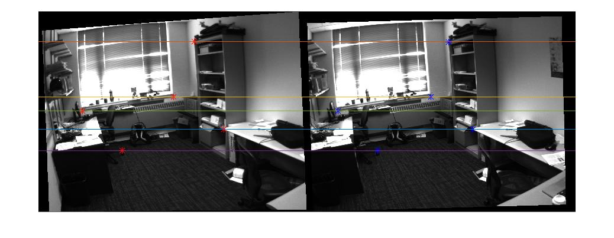
    - Finding correspondances along epipolar lines
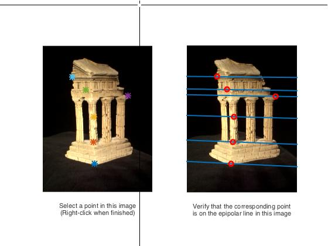
    - Computing Depth and Disparity maps
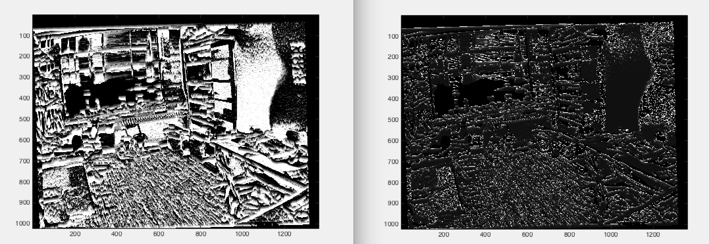
- Image Stitching :
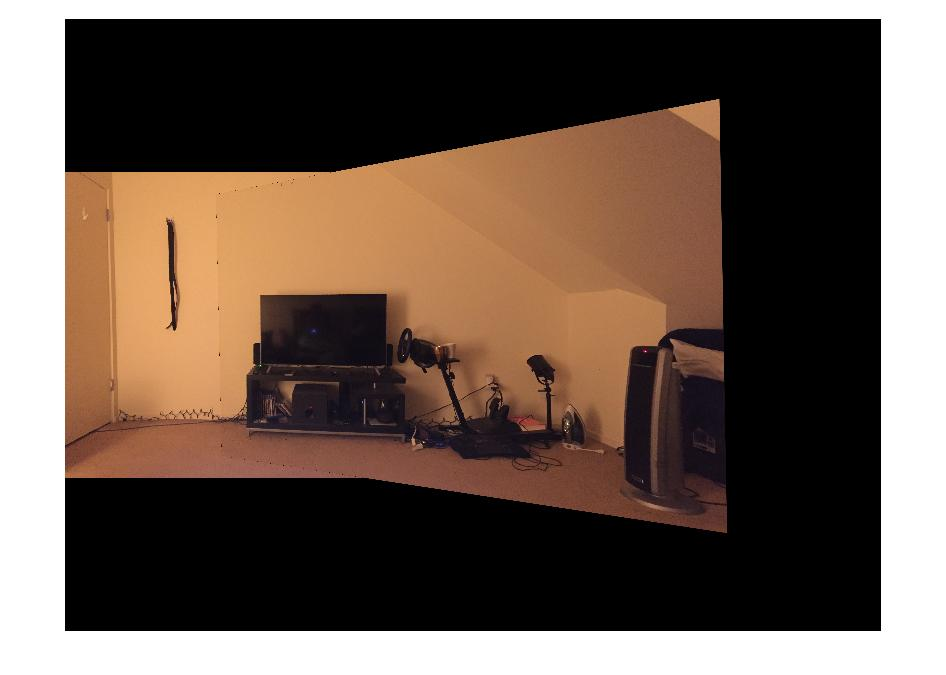
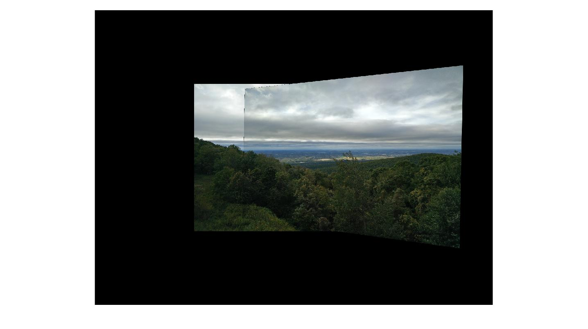
